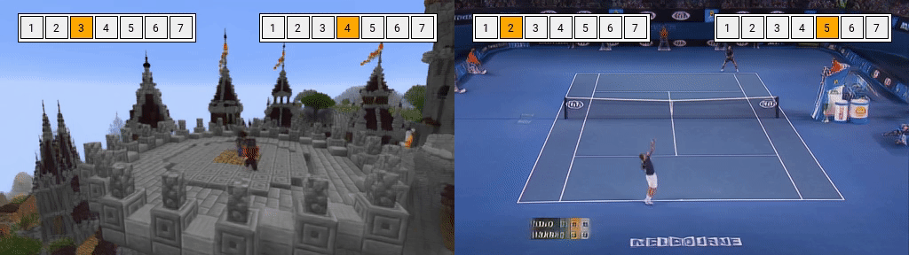

# Playable Environments: Video Manipulation in Space and Time
<br>
<p align="center">
    </em>
     <br />
     <br />
</p>
<br>

> **Playable Environments: Video Manipulation in Space and Time**<br>
> [Willi Menapace](https://www.willimenapace.com/), [Stéphane Lathuilière](https://stelat.eu/), [Aliaksandr Siarohin](https://github.com/AliaksandrSiarohin), [Christian Theobalt](https://www.mpg.de/16583907/informatics-theobalt), [Sergey Tulyakov](http://www.stulyakov.com/), [Vladislav Golyanik](https://people.mpi-inf.mpg.de/~golyanik/), [Elisa Ricci](http://elisaricci.eu/) <br>
> **CVPR 2022**

> Paper: [ArXiv](https://arxiv.org/abs/2203.01914) <br>
> Supplementary: [Website](https://willi-menapace.github.io/playable-environments-website/) <br>

> **Abstract:** *We present Playable Environments - a new representation for interactive video generation and manipulation in space and time. With a single image at inference time, our novel framework allows the user to move objects in 3D while generating a video by providing a sequence of desired actions. The actions are learnt in an unsupervised manner. The camera can be controlled to get the desired viewpoint. Our method builds an environment state for each frame, which can be manipulated by our proposed action module and decoded back to the image space with volumetric rendering.
To support diverse appearances of objects, we extend neural radiance fields with style-based modulation.
Our method trains on a collection of various monocular videos requiring only the estimated camera parameters and 2D object locations. To set a challenging benchmark, we introduce two large scale video datasets with significant camera movements. As evidenced by our experiments, playable environments enable several creative applications not attainable by prior video synthesis works, including playable 3D video generation, stylization and manipulation.*

# Requirements

We recommend the use of a Linux machine equipped with CUDA compatible GPUs.
The execution environment can be installed through Conda.
A system installation of `ffmpeg` under `/usr/bin` is also required for evaluation and interactive video generation. The requirement can be satisfied by running the following command (Ubuntu) or the corresponding one for other Linux distributions:

`sudo apt install -y ffmpeg`

## Conda

The environment can be installed and activated with:

`conda env create -f env.yml`

`conda activate playable-environments`

## Logging with Weights and Biases

The script logs training information on Weights and Biases. To enable logging, run the following command with your conda environment activated to log in to your weights and biases account:

`wandb login`

# Data

## Minecraft
The Minecraft dataset is available on [Google Drive](https://drive.google.com/drive/folders/1klOFjzm0cyfANS-5X6NgQynm-65Kh8mL?usp=sharing).

### Custom Minecraft Datasets
Custom Minecraft datasets can be acquired using a custom version of [ReplayMod](https://github.com/willi-menapace/ReplayMod) for Minecraft 16.4. We provide the [compiled ReplayMod .jar files](https://drive.google.com/drive/folders/1U8MwaVGNsJXliwzoBaJLiMm3sWlLK9NF?usp=sharing). We suggest installation of the mod files through the MultiMC Minecraft launcher. Please refer to the following [link](https://fabricmc.net/wiki/player:tutorials:install_multimc:windows) for detailed information on how to install the Minecraft mod .jar files through MultiMC. Please also refer to the [original project webpage](https://www.replaymod.com/) for additional details.

The following are the steps that are needed to acquire a custom Minecraft dataset:
1. Install our custom version of ReplayMod for Minecraft 16.4
2. Play Minecraft and record data using the mod
3. Use the in-game ReplayMod GUI to export the recorded data. In the destination folder, a video will be created and a corresponding .json file with annotations regarding cameras and player details (eg. position, orientation) will be created.
4. (Optional) re-export the recorded sequences using different texture packs and player skins
5. For each rendered video produce a file `<video_name>.txt` with the following format indicating center scene coordinates and video splits
```
    # X Y Z coordinates of the world center to use
    911 89 1260
    # Begin time and end time in seconds for each of the splits to produce for the video
    4 80
    123 160
```
6. Follow `dataset/acquisition/minecraft/scripts/make_minecraft_dataset.sh` to convert the data to the required format.

## Tennis
The Tennis dataset is downloaded from youtube and automatically created. For ease of creation, the annotations have already been computed (`/data/tennis_v7_annotation.tar.xz`) and we automatically merge them with the downloaded videos during the automated dataset creation procedure.
Scripts related to the dataset creation are found in `dataset/acquisition/tennis`. Camera calibration is based on the following [project](https://github.com/willi-menapace/tennis-court-detection).
To create the dataset, run the following command from the project root directory:

`dataset/acquisition/tennis/scripts/download_tennis_v7.sh`

## Custom datasets

The creation of custom datasets is supported through the use of the `MulticameraVideo` and the `Video` classes.
Please follow this procedure for the creation of custom datasets
1. For each custom video sequence create an empty instance of the `Video` class and populate it using the `add_content()` method.
2. For each `Video` instance, create an empty instance of the `MulticameraVideo` class and populate it with the `Video` instance using the `add_content()` method.
3. Split the set of `MulticameraVideo` instances into training, validation and test sets.
4. Create a dataset root folder and populate it with the `train`, `val` and `test` subfolders.
5. Save each `MulticameraVideo` instance in the respective subfolder using the `save()` method.

The creation of the `Video` instances is the most important part of the process and requires several arguments to be passed.
- The frames should be passed as `PIL Image` objects.
- The `cameras` parameter specifies the camera-to-world transformations as a set of x-y-z euclidean rotations (expressed as radians) and translations. It is assumed that the ground plane corresponds to the `y=0` plane (y axis points upwards). [COLMAP](https://colmap.github.io/) is suggested to aid the estimation.
- The bounding boxes are specified in the `(left, top, right, bottom)` format where the bounding box coordinates are normalized in `[0, 1]`.
- The `actions`, `rewards`, `metadata` and `dones` can safely be set to dummy values.
- Safely ignore optional arguments


# Pretrained models

Pretrained models are available from [Google Drive](https://drive.google.com/drive/folders/1JUFgdPh0hZopFbIDQjaUrl7j2WjDZbPD?usp=sharing).

To use the pretrained models download the shared folder and place the contents inside the `checkpoints` directory.

# Training

The model is trained in 3 successive phasees:
- **Phase 1**: Training of the feature renderer F
- **Phase 2**: Training of the synthesis module
- **Phase 3**: Training of the action module

## Phase 1: Feature Renderer Pretraining
The first phase of training consists in the training of the feature renderer F. Training can be performed by issuing the following commands:

Minecraft:

`python train_autoencoder.py --config configs/minecraft/autoencoder/01_minecraft_v1_autoencoder_v9_feat_128_bott_3_levels_2_input_augm_pl_0.01_kl_0.000005_bs_20_res_512.yaml`

Tennis:

`python train_autoencoder.py --config configs/tennis/autoencoder/40_tennis_v7_autoencoder_v8_feat_128_bott_3_levels_2_input_augm_pl_0.01_kl_0.000005_bs_20_res_512.yaml`

We train the feature renderer using 1x Nvidia RTX 8000 GPU.

Checkpoints are saved under the `checkpoints/` directory.
Qualitative results are saved under the `results/` directory.
Training curves are logged on Weights and Biases.

## Phase 2: Synthesis module Training
The second phase of training consists in the training of the synthesis module. Training can be performed by issuing the following commands:

Minecraft:

`python train.py --config configs/minecraft/013_minecraft_v1_multiresolution_backpropagated_decoder_1_300k_skybox_v3_pretr_1k_reweighted_patch_48_rl_1.0_pl_0.1_kl_0.5e-5_autolr_1e-4_div_0.0_spi_150_bs_8_obs_3_skip_100_res_512.yaml`

Tennis:

`python train.py --config configs/tennis/playability/100_playability_tennis_v7_model_193_dyn_v4_act_v5_discriminator_v7_no_style_action_dir_pred_beta_0.5_rtds_3-256_ganlamb_0.1_dganlamb_1.0_acmv_0.1_dyn_v4_2-256_bs_64_observations_4-4-5-9.yaml`

On Minecraft, we train the synthesis module using 2x Nvidia RTX 8000 GPUs, on Tennis we train the model using 4x Nvidia RTX 8000 GPUs.

Checkpoints are saved under the `checkpoints/` directory.
Qualitative results are saved under the `results/` directory.
Training curves are logged on Weights and Biases.

## Phase 3: Action module Training
The third phase of training consists in the training of the action module. Training can be performed by issuing the following commands:

Minecraft:

`mkdir checkpoints/022_playability_minecraft_v1_model_013_dyn_v9_act_v5_discriminator_v7_no_style_act_dir_beta_0.5_rtds_3-256_ganlamb_0.1_dganlamb_1.0_acmv_0.1_dyn_v4_3-256_bs_64_observations_4-4-5-9_run_1`

`cp checkpoints/013_minecraft_v1_multiresolution_backpropagated_decoder_01_300k_skybox_v3_pretr_1k_reweighted_patch_48_rl_1.0_pl_0.1_div_0.0_kl_0.5e-5_autolr_1e-4_spi_1600_bs_8_obs_3_skip_100_res_512_run_1/latest.pth.tar checkpoints/022_playability_minecraft_v1_model_013_dyn_v9_act_v5_discriminator_v7_no_style_act_dir_beta_0.5_rtds_3-256_ganlamb_0.1_dganlamb_1.0_acmv_0.1_dyn_v4_3-256_bs_64_observations_4-4-5-9_run_1`

`python train_playable_mode.py --config configs/minecraft/playability/022_minecraft_v1_model_013_dyn_v9_act_v5_discriminator_v7_no_style_act_dir_beta_0.5_rtds_3-256_ganlamb_0.1_dganlamb_1.0_acmv_0.1_3-256_bs_64_observations_4-4-5-9.yaml`

Tennis:

`mkdir checkpoints/100_playability_tennis_v7_model_193_dyn_v4_act_v5_discriminator_v7_no_style_action_dir_beta_0.5_rtds_3-256_ganlamb_0.1_dganlamb_1.0_acmv_0.1_dyn_v4_2-256_bs_64_observations_4-4-5-9_run_1`

`cp checkpoints/193_tennis_v7_adain_style_multiresolution_backpropagated_decoder_40_300k_pretr_5k_patch_64_crop_align_style_64_skip_4_frl_0.0_rl_1.0_pl_0.1_kl_0.5e-5_norm_autolr_1e-4_div_0.0_al_0.0_spi_400_bs_8_obs_4_res_512_run_1/latest.pth.tar checkpoints/100_playability_tennis_v7_model_193_dyn_v4_act_v5_discriminator_v7_no_style_action_dir_beta_0.5_rtds_3-256_ganlamb_0.1_dganlamb_1.0_acmv_0.1_dyn_v4_2-256_bs_64_observations_4-4-5-9_run_1`

`python train_playable_mode.py --config configs/tennis/playability/100_playability_tennis_v7_model_193_dyn_v4_act_v5_discriminator_v7_no_style_action_dir_pred_beta_0.5_rtds_3-256_ganlamb_0.1_dganlamb_1.0_acmv_0.1_dyn_v4_2-256_bs_64_observations_4-4-5-9.yaml`

First, the latest checkpoint from Phase 2 is transferred, then training is started. We train the action module using 1x Nvidia RTX 8000 GPU.

Checkpoints are saved under the `checkpoints/` directory.
Qualitative results are saved under the `results/` directory.
Training curves are logged on Weights and Biases.

# Evaluation
Evaluation is performed after Phase 2 and after Phase 3 for the synthesis module and the action module respectively.

For evaluation on Minecraft please download the pretrained Minecraft player detector `detection_model_minecraft` from [Google Drive](https://drive.google.com/drive/folders/1JUFgdPh0hZopFbIDQjaUrl7j2WjDZbPD?usp=sharing).


## Phase 2 evaluation

Minecraft:

`python generate_reconstructed_dataset.py --config configs/minecraft/013_minecraft_v1_multiresolution_backpropagated_decoder_1_300k_skybox_v3_pretr_1k_reweighted_patch_48_rl_1.0_pl_0.1_kl_0.5e-5_autolr_1e-4_div_0.0_spi_150_bs_8_obs_3_skip_100_res_512.yaml`

`python evaluate_reconstructed_dataset.py --config configs/minecraft/013_minecraft_v1_multiresolution_backpropagated_decoder_1_300k_skybox_v3_pretr_1k_reweighted_patch_48_rl_1.0_pl_0.1_kl_0.5e-5_autolr_1e-4_div_0.0_spi_150_bs_8_obs_3_skip_100_res_512.yaml`

`python evaluate_fvd_reconstructed_dataset.py --config configs/minecraft/013_minecraft_v1_multiresolution_backpropagated_decoder_1_300k_skybox_v3_pretr_1k_reweighted_patch_48_rl_1.0_pl_0.1_kl_0.5e-5_autolr_1e-4_div_0.0_spi_150_bs_8_obs_3_skip_100_res_512.yaml`

Tennis:

`python generate_reconstructed_dataset.py --config configs/tennis/193_tennis_v7_adain_style_multiresolution_backpropagated_decoder_40_300k_pretr_5k_patch_64_crop_align_style_64_skip_4_frl_0.0_norm_rl_1.0_pl_0.1_kl_0.5e-5_autolr_1e-4_div_0.0_spi_400_bs_8_obs_4_res_512.yaml`

`python evaluate_reconstructed_dataset.py --config configs/tennis/193_tennis_v7_adain_style_multiresolution_backpropagated_decoder_40_300k_pretr_5k_patch_64_crop_align_style_64_skip_4_frl_0.0_norm_rl_1.0_pl_0.1_kl_0.5e-5_autolr_1e-4_div_0.0_spi_400_bs_8_obs_4_res_512.yaml`

`python evaluate_fvd_reconstructed_dataset.py --config configs/tennis/193_tennis_v7_adain_style_multiresolution_backpropagated_decoder_40_300k_pretr_5k_patch_64_crop_align_style_64_skip_4_frl_0.0_norm_rl_1.0_pl_0.1_kl_0.5e-5_autolr_1e-4_div_0.0_spi_400_bs_8_obs_4_res_512.yaml`

First, the test dataset is reconstructed, then the evaluation metrics are produced. FVD is computed separately in the last invocation.
Results are stored under `results/` in the directory corresponding to the training process with names `reconstructed_dataset_evaluation.yaml` and `reconstructed_dataset_fvd_evaluation.yaml`.

## Phase 3 evaluation

Minecraft:

`python generate_reconstructed_playability_dataset.py --config configs/minecraft/playability/022_minecraft_v1_model_013_dyn_v9_act_v5_discriminator_v7_no_style_act_dir_beta_0.5_rtds_3-256_ganlamb_0.1_dganlamb_1.0_acmv_0.1_3-256_bs_64_observations_4-4-5-9.yaml`

`python evaluate_reconstructed_playability_dataset.py --config configs/minecraft/playability/022_minecraft_v1_model_013_dyn_v9_act_v5_discriminator_v7_no_style_act_dir_beta_0.5_rtds_3-256_ganlamb_0.1_dganlamb_1.0_acmv_0.1_3-256_bs_64_observations_4-4-5-9.yaml`

Tennis:

`python generate_reconstructed_playability_dataset.py --config configs/tennis/playability/100_playability_tennis_v7_model_193_dyn_v4_act_v5_discriminator_v7_no_style_action_dir_pred_beta_0.5_rtds_3-256_ganlamb_0.1_dganlamb_1.0_acmv_0.1_dyn_v4_2-256_bs_64_observations_4-4-5-9.yaml`

`python evaluate_reconstructed_playability_dataset.py --config configs/tennis/playability/100_playability_tennis_v7_model_193_dyn_v4_act_v5_discriminator_v7_no_style_action_dir_pred_beta_0.5_rtds_3-256_ganlamb_0.1_dganlamb_1.0_acmv_0.1_dyn_v4_2-256_bs_64_observations_4-4-5-9.yaml`

First, the test dataset is reconstructed, then the evaluation metrics are produced.
Results are stored under `results/` in the directory corresponding to the training process with name `reconstructed_playability_dataset_evaluation.yaml`.

# Interactive generation of videos

After training, videos can be interactively generated by the user issuing the following commands:

Minecraft:

`python play.py --config configs/minecraft/playability/022_minecraft_v1_model_013_dyn_v9_act_v5_discriminator_v7_no_style_act_dir_beta_0.5_rtds_3-256_ganlamb_0.1_dganlamb_1.0_acmv_0.1_3-256_bs_64_observations_4-4-5-9.yaml`

Tennis:

`python play.py --config configs/tennis/playability/100_playability_tennis_v7_model_193_dyn_v4_act_v5_discriminator_v7_no_style_action_dir_pred_beta_0.5_rtds_3-256_ganlamb_0.1_dganlamb_1.0_acmv_0.1_dyn_v4_2-256_bs_64_observations_4-4-5-9.yaml`

When loading completes, a window appears showing a randomly chosen frame from the dataset. The user is prompted to specify an action in the range [1-7] for object 1.
With the appeared window focused, the user can specify the action by pressing the corresponding number on the keyboard. Successively, the user is prompted to specify an action in the range [1-7] for object 2.
When the second action is issued, the next frame is produced by the model and shown in the window. The process repeats until the user presses key 0 on the keyboard which resets the process.

# Citation

```
@InProceedings{Menapace2022PlayableEnvironments,
    author    = {Menapace, Willi and Lathuilière, Stéphane and Siarohin, Aliaksandr and Theobalt, Christian and Tulyakov, Sergey and Golyanik, Vladislav and Ricci, Elisa},
    title     = {Playable Environments: Video Manipulation in Space and Time},
    booktitle = {Proceedings of the IEEE/CVF Conference on Computer Vision and Pattern Recognition},
    year      = {2022}
}
```


